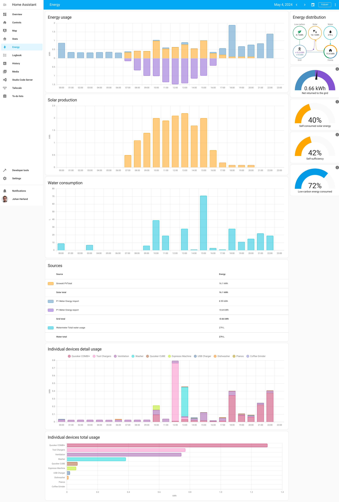
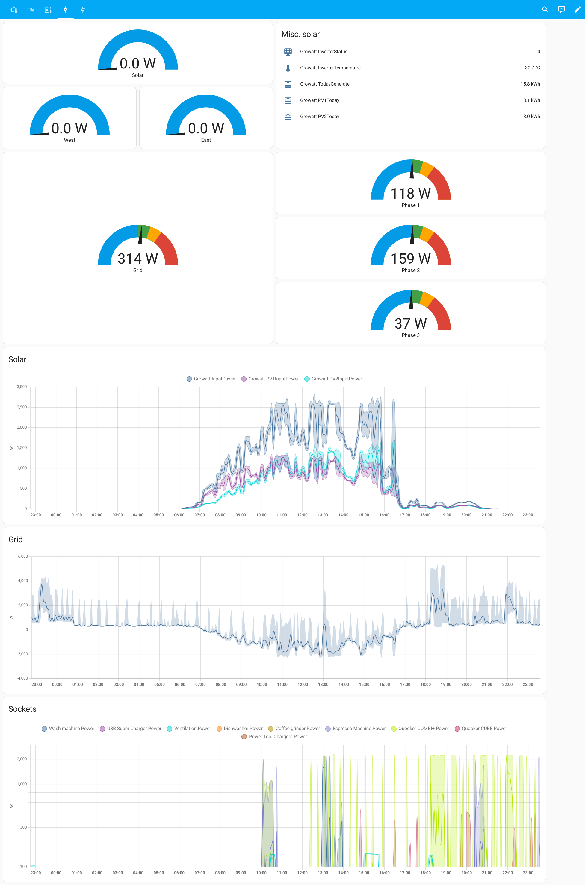

# Home Assistant configuration

This repo is incomplete due to most of the configuration being done in the user
interface of Home Assistant.

Anyway, here is an attempt to describe everything that's going on here:

## Situation

Dutch row house built in 2022, taken over in early 2024 with this infrastructure:
- Regular connection to the power (3 phases) and water grid
- No gas connection
- PVT solar panels with integrated heat exchangers from [Triple Solar](https://triplesolar.eu/en/),
  hooked up to a [Growatt MIN 3600TL-X inverter](https://growatt.tech/product/growatt-min-3600-tl-x-1-phase-inverter/)
- Heat Pump ([NIBE F1255-6](https://www.nibe.eu/en-eu/products/heat-pumps/ground-source-heat-pumps/f1255))
  managing hot water and water-borne floor heating/cooling
- Ventilation ([Itho Daalderop HRU 400](https://www.ithodaalderop.nl/hru400)) with heat recovery

## Home Assistant server and related devices

- [Home Assistant Yellow](https://www.home-assistant.io/yellow/)
    - supports Power-over-Ethernet and comes with built-in ZigBee radio/controller,
    - additional [Aeotec Z Stick 5](https://aeotec.com/products/aeotec-z-stick-gen5/) Z-Wave radio/controller connected via USB,
    - using [Tailscale](https://tailscale.com) for secure access from anywhere.
- [Homewizard](https://www.homewizard.com) monitorting devices:
    - [Wi-Fi P1 meter](https://www.homewizard.com/shop/wi-fi-p1-meter-rj12-2/) measure power to/from grid.
    - [Wi-Fi Watermeter](https://www.homewizard.com/shop/wi-fi-watermeter/) measures overall water consumption.
    - [Energy sockets](https://www.homewizard.com/shop/wi-fi-energy-socket-16a-set/) controls various devices and measures their energy use.
    - [Wi-Fi kWh meter 3-phase MID](https://www.homewizard.com/shop/wi-fi-kwh-meter-3-phase/) measures energy use of heat pump.
- [Growatt ShineWiFi-X MQTT by SDR Engineering](https://www.sdr-engineering.nl/webshop/index.php?route=product/product&product_id=60) connects to the Growatt inverter and allows local monitoring (MQTT messages over local Wifi) of the solar inverter.
- [NibePi](https://github.com/anerdins/nibepi) connects to heat pump over RS-485/MODBUS for more monitoring/control.
- [Itho CVE RFT WiFi add-on](https://www.tindie.com/products/nrgwatch/itho-cve-rft-wifi-add-on/) monitoring the wireless communication between the Itho [RFT CO2](https://www.ithodaalderop.nl/nl-NL/professional/product/04-00045)/[RFT RV](https://www.ithodaalderop.nl/nl-NL/professional/product/04-00046) in-room units and the main ventilation unit. (This currently does not control the ventilation unit, but gives insight into the sensor values and commands being sent from the in-room units.)
- Various other smart plugs (in decreasing order of preference):
    - [HomeWizard Energy sockets](https://www.homewizard.com/shop/wi-fi-energy-socket-16a-set/) (local WiFi) as already mentioned above
    - [BlitzWolf SHP-15](https://www.blitzwolfeurope.com/Blitzwolf-BW-SHP15-ZigBee-3-0-Smart-Socket-220V) (Zigbee)
    - [Innr Smart Plug EU](https://www.innr.com/en/product/innr-smart-plug-eu-with-power-monitoring/) (ZigBee)
    - [Hombli Smart Socket Duo](https://www.hombli.com/products/smart-socket-duo/) (WiFi via Tuya cloud)
    - [Nexa AN-180](https://nexa.se/smarta-hem/z-wave/an-180) (Z-Wave, only <1500W)
- Various other sensors:
    - Airthings air quality sensors, [View Plus](https://www.airthings.com/view-plus) and [Wave Plus](https://www.airthings.com/wave-plus) (via cloud)
    - Various [IKEA TRÅDFRI]() bulbs (ZigBee)
    - [IKEA BADRING](https://www.ikea.com/nl/en/p/badring-water-leakage-sensor-smart-60504352/) water leak sensors (ZigBee)
    - [IKEA PARASOLL](https://www.ikea.com/nl/en/p/parasoll-door-window-sensor-smart-white-80504308/) door/window sensor (ZigBee)
    - [Aeotec MultiSensor 7](https://aeotec.com/products/aeotec-multi-sensor-6/) presence/environment sensor (Z-Wave)
    - [Aeotec WallMote Quad](https://aeotec.com/products/aeotec-wallmote-quad/) buttons (Z-Wave)
- Other smart devices hooked up to Home Assistant:
    - Unifi Ubiquiti local network management
    - LG OLED TV
    - Denon DN-500AV surround receiver
    - Meater thermometer (via cloud)
    - Phones for presence detection

### Screenshots

#### Default Energy View

#### Customized Power View

### Future plans

- Control + monitor the ventilation unit more directly via its MODBUS interface, e.g. https://gathering.tweakers.net/forum/list_messages/2109156

## More resources

- From Triple Solar, about the PVT panels:
    - https://triplesolar.eu/project/pvt-panelen-spoorzone-delft/
    - https://triplesolar.eu/wat-is-een-pvt-paneel/
